# Linking three dimensional position and rotation data to a 3D model
These steps can be applied to animating the position and orientation of any 3D object over time. Here we demonstrate the concept with some fake sample data and a simple 3D model of an elephant seal.

There is a [PDF](https://drive.google.com/file/d/1Zm0K7j4koVARX3nUgLMaKWe7GX1JuIE0/view) and [video version](https://www.youtube.com/watch?v=gSccR7FzP0Q&feature=emb_imp_woyt) of this tutorial if you prefer to learn in either of those formats. See our [online learning center](https://www.jessiekb.com/resources) for a full list of our tutorials.
[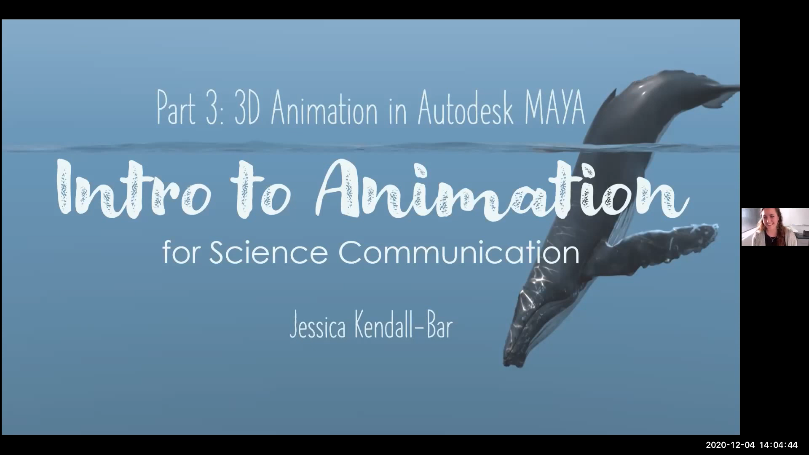](https://www.youtube.com/watch?v=gSccR7FzP0Q&feature=emb_imp_woyt)

## Data Processing
We first need to process the data to get it into the proper format. If you have 3-axis inertial motion sensors and a way to measure speed, you can calculate the three dimensional position and rotation for an animal with high precision, especially at high speeds. For more advice on how to process your data- follow this helpful tutorial: [Animal Orientation Tutorial by Mark Johnson](https://synergy.st-andrews.ac.uk/soundtags/files/2013/01/animal_orientation_tutorial.pdf).

### Example data:

See a sample dataset in our data folder called [Example_PositionRotationData.csv](data/Example_PositionRotationData.csv)
Your data should be translated to a format similar to this:
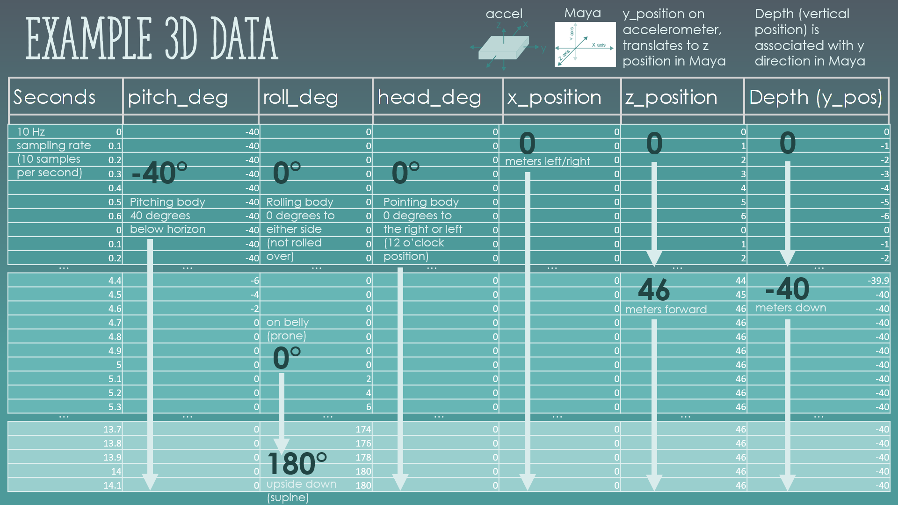

## Linking data to 3D model position

1. **Download and store 3D model**

    Find a free 3D model online with an .obj download option and download it. 

    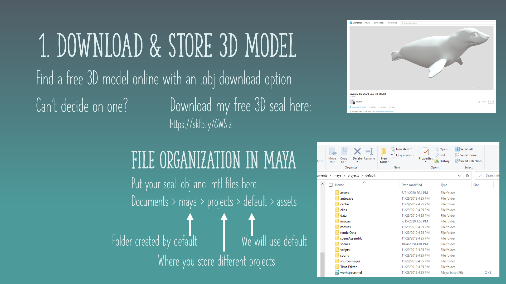

1. **Import 3D model**

    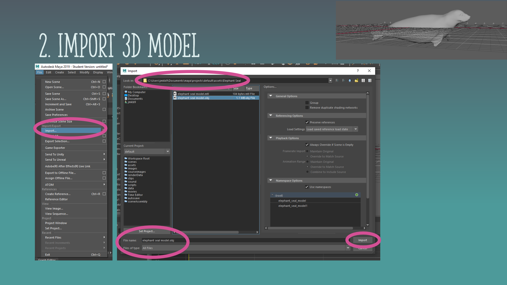

1. **Rename your model**

    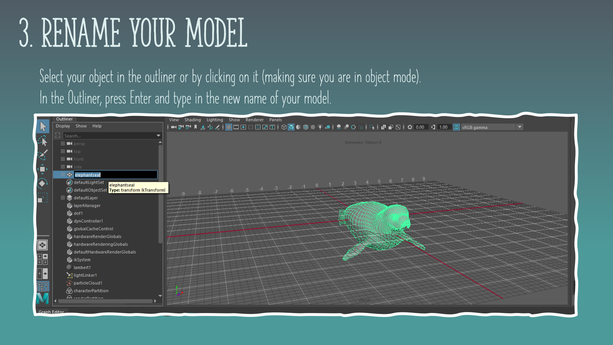

1. **Save your scene**

    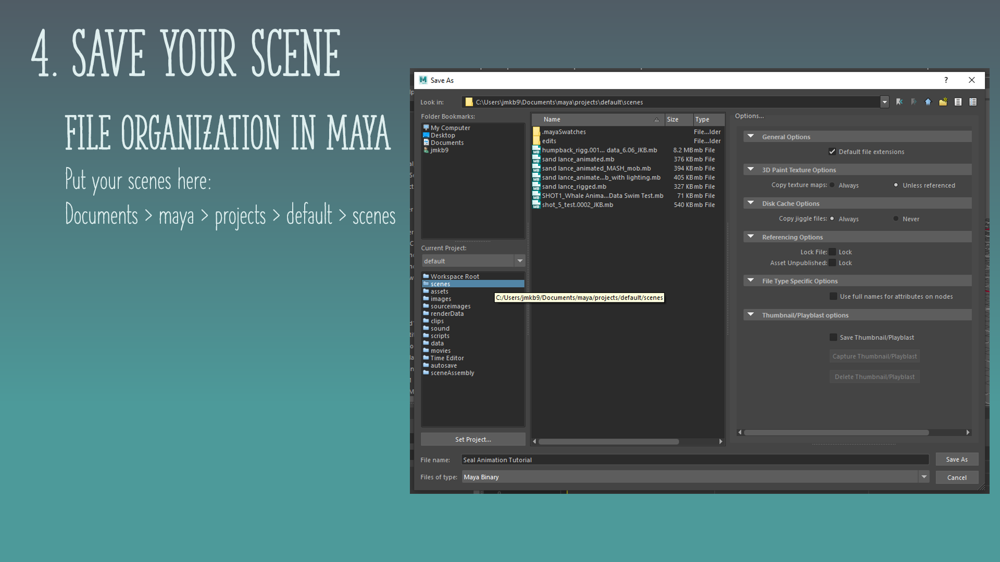

1. **Open the script editor**

    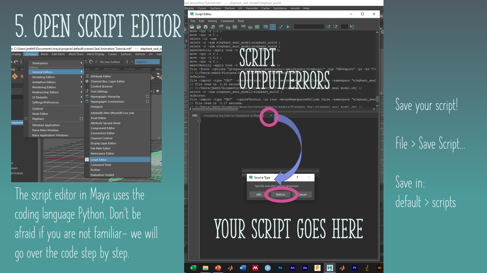

1. **Check your data**

    Check that your data is in the format listed here.
    

1. **Enter your code**

    Enter the code from `03_setKeysFromData_positionRotation.py` (or copy/paste from here into your script editor).

        import csv
        import pymel.core as pm

        #Defining variables which will be used as column indices
        SECONDS      = 0
        PITCH_DEG    = 1
        ROLL_DEG     = 2
        HEAD_DEG     = 3
        X_POS        = 4
        Z_POS        = 5
        DEPTH        = 6
        
        #Defining two variables which will be used as indices where animation starts and ends 
        START = 0  #start time in sec
        END = 12   #end time in sec

        fs = 10 #Sample frequency (in Hz or "samples per second")

        #Reading in .csv file (update to reflect your own path)
        with open('~data/V1_Example_PositionRotationData.csv') as csv_file:
            data = csv.reader(csv_file, delimiter=',')
            
            #For loop runs through all rows in data .csv file
            for i, row in enumerate(data):
                if i % 10000 == 0:
                    print 'Processing row %s' % (i)
                    #Print progress in with data row counter in console to keep track of if/where code gets stuck
                        
                #If the row number is between the start and end indices of where we want to animate, run this code.        
                if i >= START*fs and i < END*fs: 
                    
                    #We will use the function float() to return floating point numbers (with decimals) for data values
                    
                    time = float(i) / fs - START #Translate .csv data time into animation time
                    time = time * 24 #Get from frames to seconds
                    
                    translateX_value = float(row[X_POS])
                    translateZ_value = float(row[Z_POS]) #to fit axis orientations
                    depth_value      = float(row[DEPTH])
                    
                    #Define which object will be transformed according to data (use name as described in "Outliner")
                    object = pm.ls('elephantseal')[0] 
                    
                    #..setKey function sets a keyframe of the given value at the given time.
                    object.translateX.setKey(value=translateX_value, time=time)
                    object.translateZ.setKey(value=translateZ_value, time=time)
                    object.translateY.setKey(value=depth_value, time=time)
                    
                    pitch_value = -float(row[PITCH_DEG]) 
                    head_value  = float(row[HEAD_DEG])
                    roll_value  = float(row[ROLL_DEG])
                    
                    #..setKey function sets a keyframe of the given value at the given time.
                    object.rotateX.setKey(value=pitch_value, time=time)
                    object.rotateY.setKey(value=head_value, time=time)
                    object.rotateZ.setKey(value=roll_value, time=time)

                    print 'setting y= %s msw, x= %s, z= %s, rotX= %s, rotY= %s, rotZ = %s for time= %s frames' % (depth_value , translateX_value , translateZ_value , pitch_value , head_value , roll_value , time)`

1. **Preview animation**

    

1. **Smooth animation**

    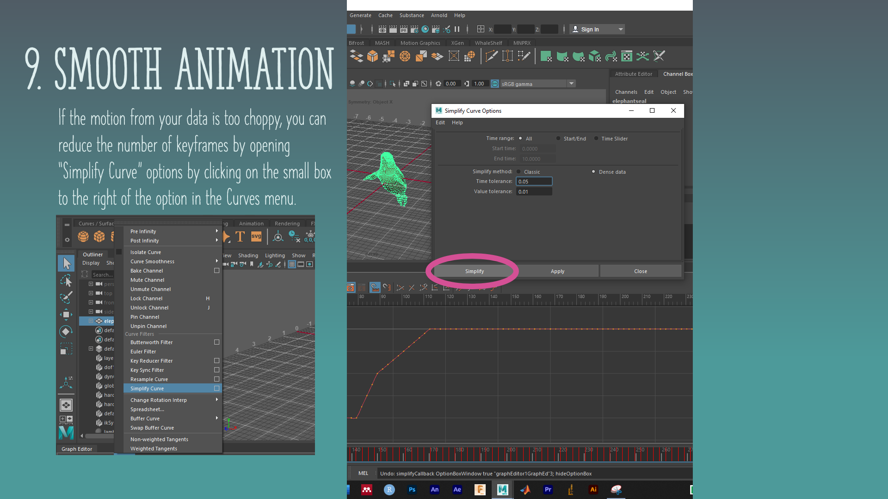

1. **Playblast animation**

    

1. **Scale your scene**
1. **Texture your seal**

    

1. **Add some water**

    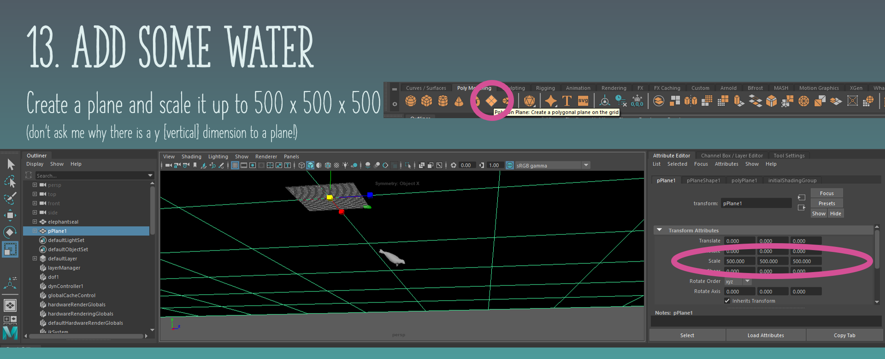

1. **Open render preview**
1. **Create a SkyDome light**
1. **Press play to preview**
1. **Create node for SkyDome**
    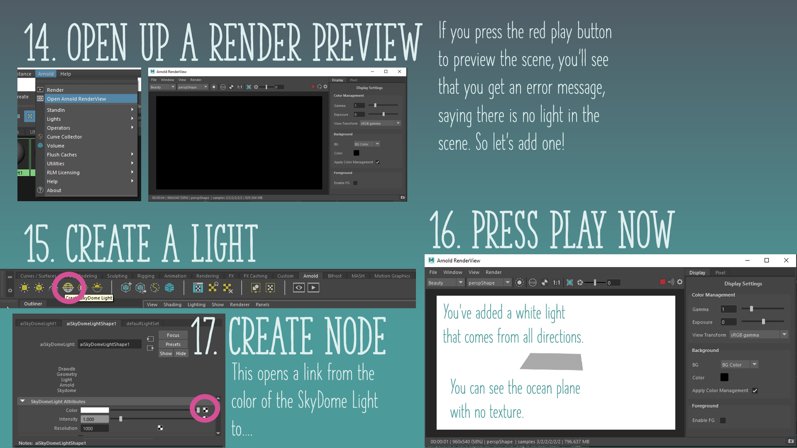

1. **Link SkyDome light to color ramp**
1. **Update preview**
    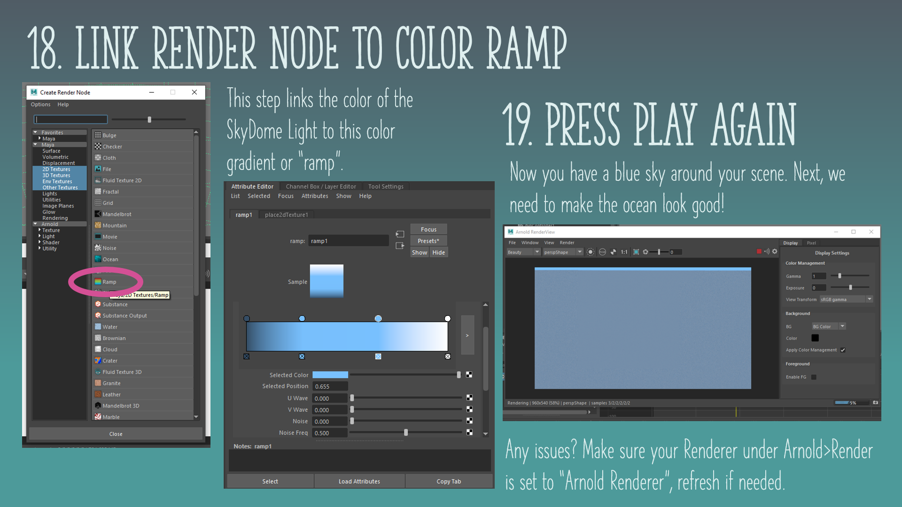

1. **Assign a texture to your ocean**
    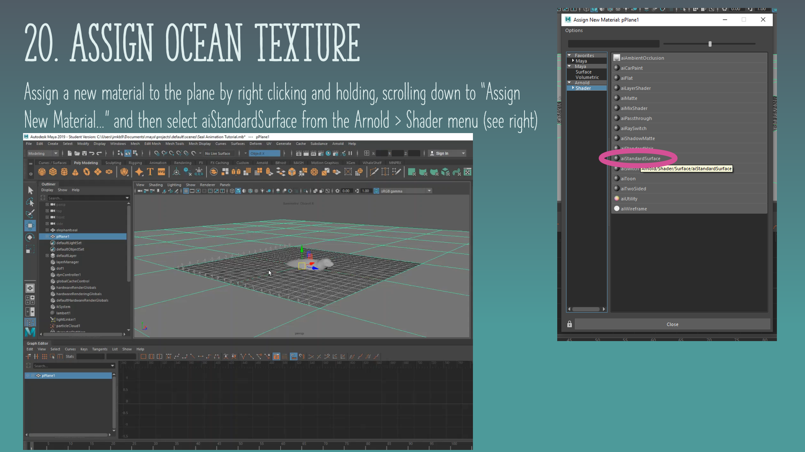

1. **Another method to assign texture**
    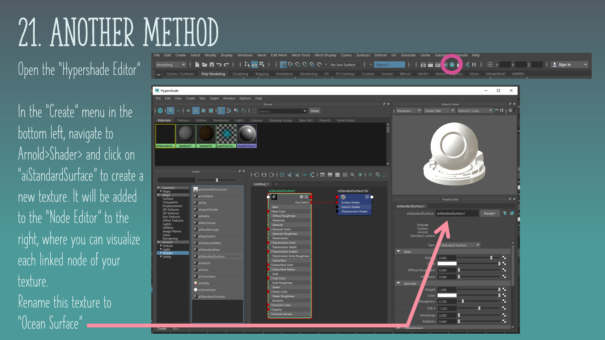

1. **Customize ocean surface texture**
1. **Update preview**
    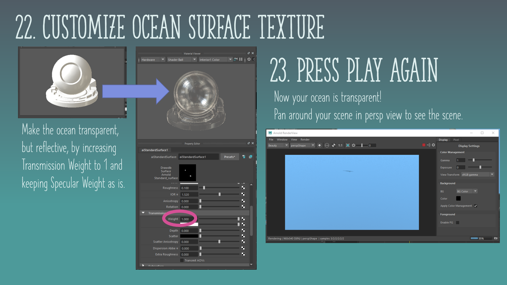

1. **Link a file to use as a displacement map for the the surface of the ocean**
    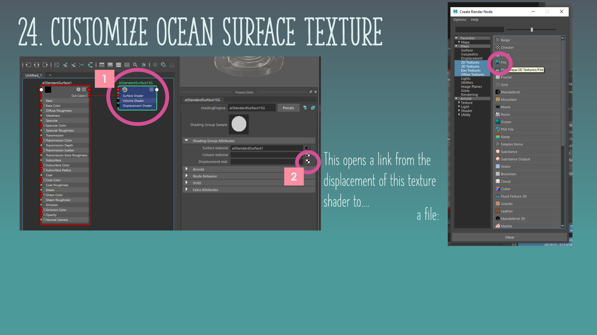

1. **Find your files**

    Select the folder icon and navigate to a saved copy of this file repository: [Google Drive file repository with ocean texture image sequence](https://drive.google.com/open?id=1bBsvTaLZItFbBCJkwwiwc2Rr9Ov4nPj-&authuser=jmkendal%40ucsc.edu&usp=drive_fs)

    Select the first image of the sequence.

    These displacement image maps were generated in Maya using the Boss Spectral Wave Solver with parameters similar to those in the open ocean, to give a real sense of adventure in the sea!
    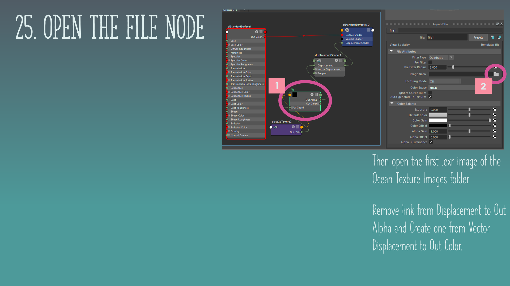

1. **Adjust the scale of the texture**

    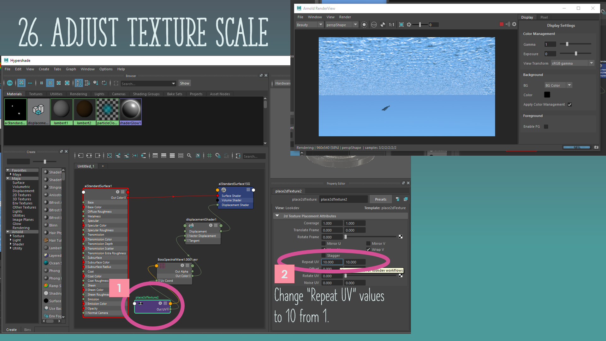

1. **Loop the image sequence using an expression**

    Enter this code to loop through all the images in the folder:
    `File2.frameExtensions=((frame%120)+1);`

    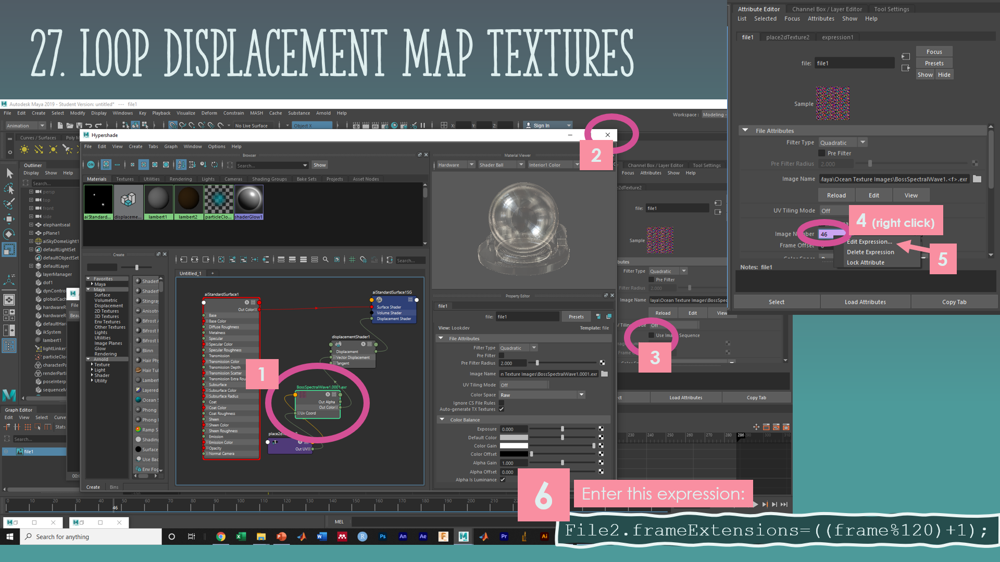

1. **Render your scene**

    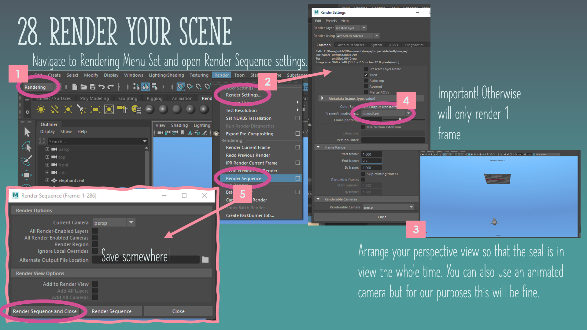

1. **Make a video with your scene**

    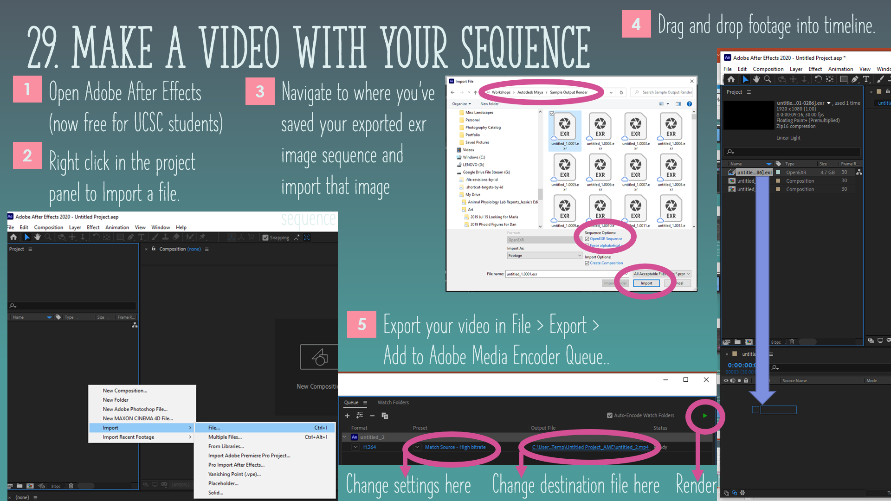

1. **Enjoy your animation!**

    

