# Linking two dimensional data to line animations in After Effects
These steps can be applied to animating line data over time. Here we demonstrate the concept with some sample data on COVID cases from 

There is a [PDF](https://drive.google.com/file/d/11D-X7jaVxfqbnESMDX1sLL_BUEhXPraa/view) and [video version](https://youtu.be/gqGEqlRfcfE) of this tutorial if you prefer to learn in either of those formats. See our [resources webpage](https://www.jessiekb.com/resources) for a full list of our tutorials.

1. **Create new composition**
    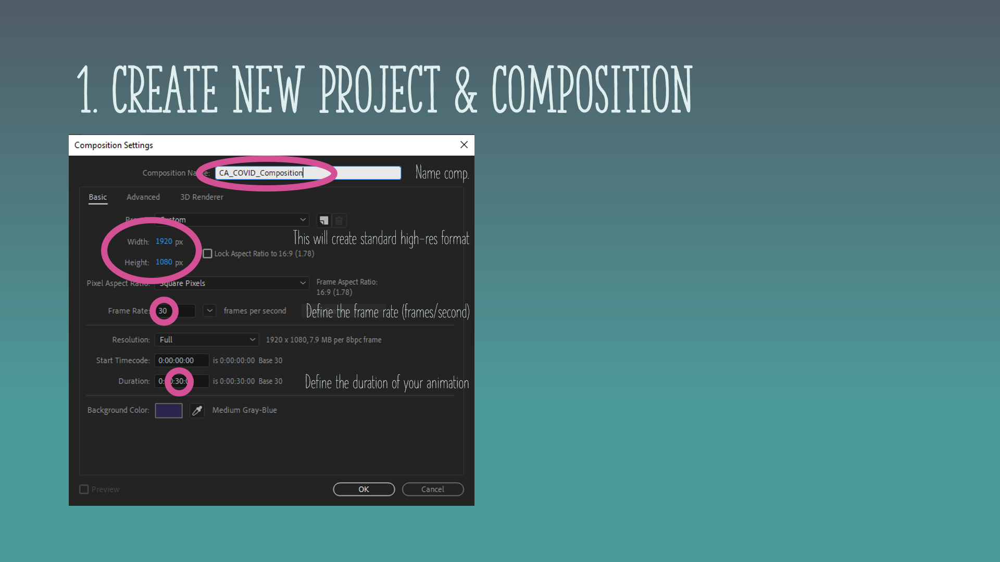
1. **Import CSV**
1. **Drag into Composition**
1. **Explore your file**
    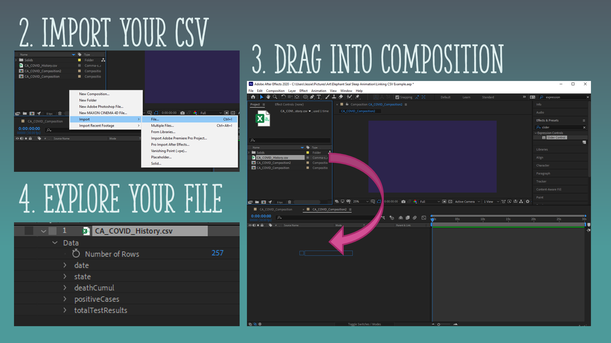
1. **Add a new shape layer**
1. **Create path with the pen tool**
    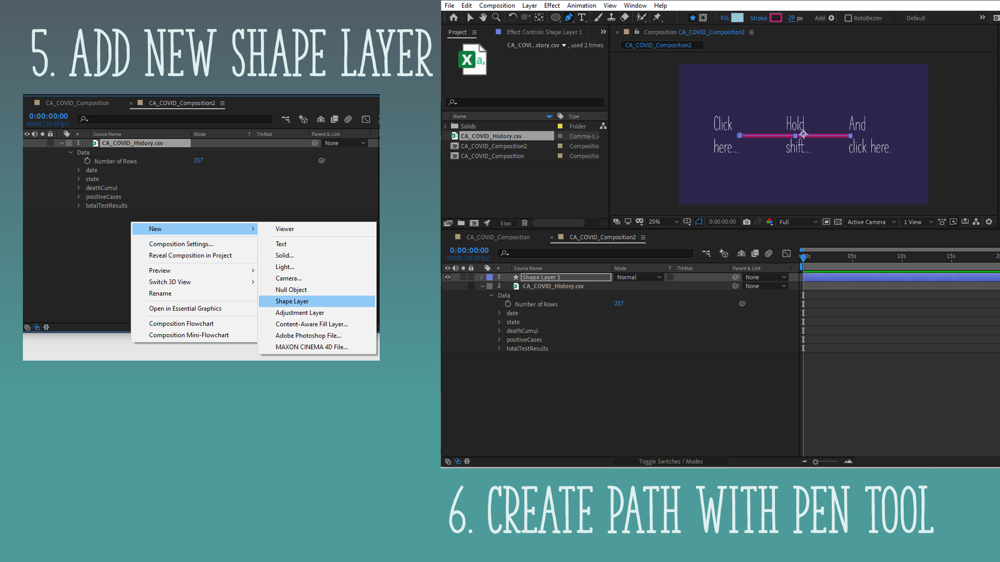
1. **Format shape**
1. **Open expression** (Alt + click the stopwatch for the path in the shape layer)
1. **Add this expression:**
    This expression links the x and y values of the data to horizontal and vertical positions on the canvas.

        var numberOfPoints = thisComp.layer("CA_COVID_History.csv")("Data")("Number of Rows");
        //Setting # of Point variable equal to the number of rows of data in CSV
        var spacingForPoints = thisComp.width / numberOfPoints; //Spacing points
        var startingPointX = 0; //Setting the first X value position
        var thePath = content("Shape 1").content("Path 1").path; //Renaming path
        var maximumYValue = 1200000; //Maximum Y value
        var lineHeight = 0; //Initializing lineHeight variable
        var arrayOfPoints = []; //Creating an empty array called arrayOfPoints

        for(var i = 0; i < numberOfPoints; i++) { 
        //Writing a for loop that loops through each row of data
        var data = thisComp.layer("CA_COVID_History.csv");
        var dailyCases = data.footage("CA_COVID_History.csv").dataValue([3,i])
        lineHeight = linear(dailyCases, 0, maximumYValue, content("Shape 1").content("Stroke 1").strokeWidth/2, thisComp.height)*-1;
        //Function remaps data from the bottom of the composition to the top.
        arrayOfPoints[i] = [startingPointX, lineHeight];
        //Store new x and y data into the array arrayOfPoints
        startingPointX += spacingForPoints;
        //Update x value by adding the spacing between points
        }

        thePath.createPath(points=arrayOfPoints, inTangents=[], outTangents=[], is_closed=false);
        //Create a path with the array of points and keep it an open path

    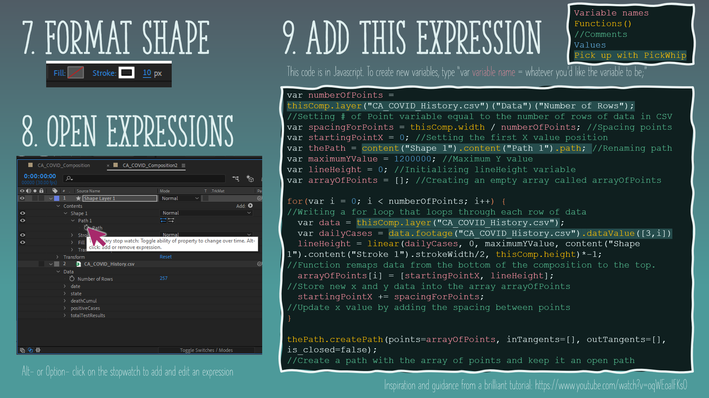

1. **Align path**
1. **Rename shape layer**

    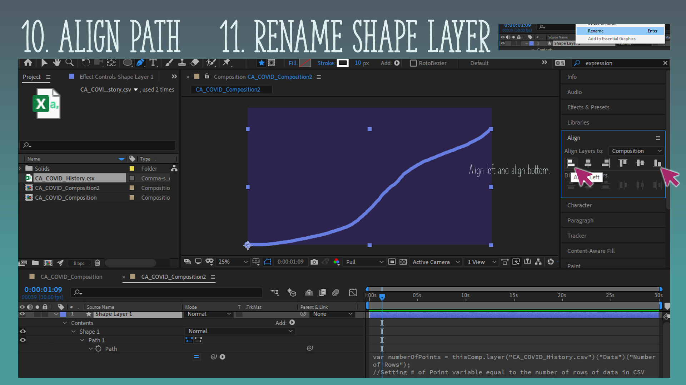

1. **Duplicate layer**
1. **Rename duplicate**
1. **Link layer to parent**
1. **Change fill & stroke**
1. **Add trim path to shape**

    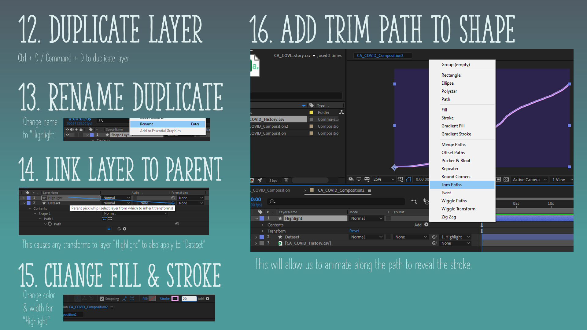

1. **Set end of data animation**
1. **Add keyframes**
1. **Navigate to the beginning**
1. **Add keyframes**
1. **Change values**

    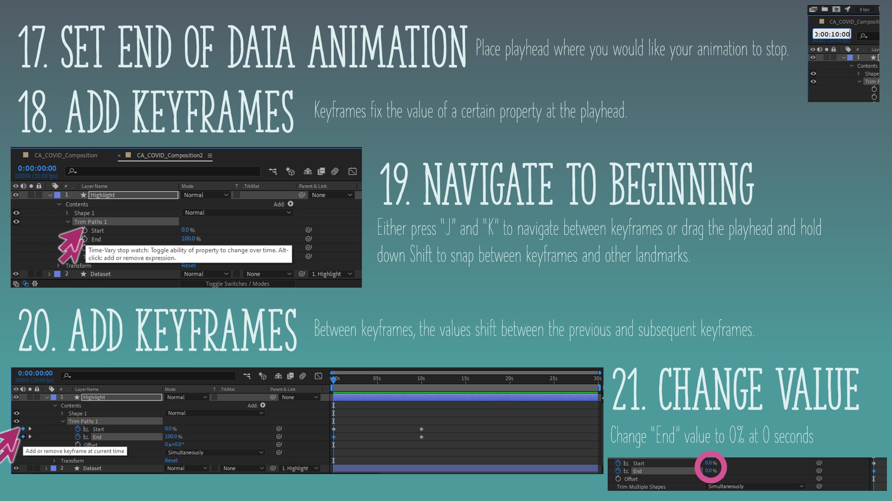

1. **Preview Animation**
1. **Select Keyframes**
1. **Copy/paste keyframes**
1. **Adjust trim path**
1. **Let highlight exit**

    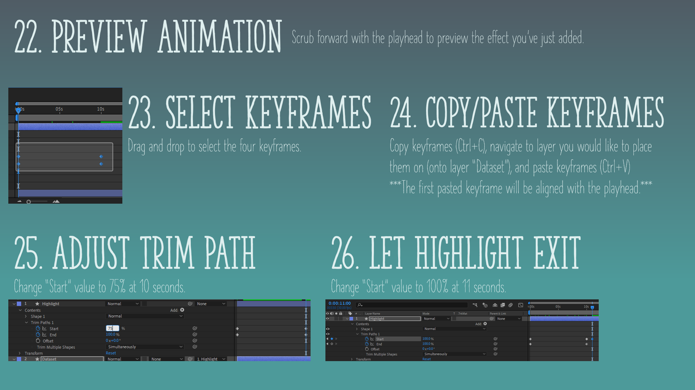

1. **Add some style**

    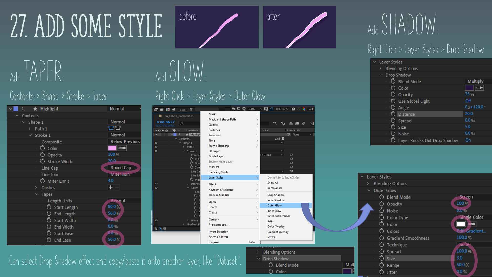

1. **Add text counter**
1. **Add a slider control**
1. **Add an expression**: 

`var current = Math.floor(effect("Slider Control")("Slider"))

var dailyCaseData = footage("03_Example_LineAnimation_COVIDdata.csv").dataValue([3,current]);

dailyCaseData;`

    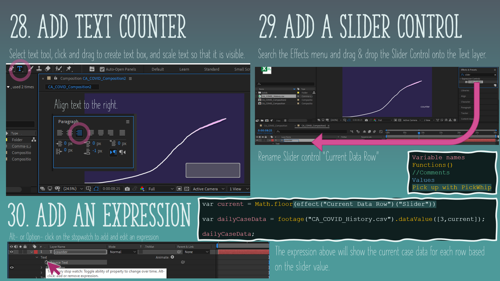

1. **Set slider keyframes**
    
    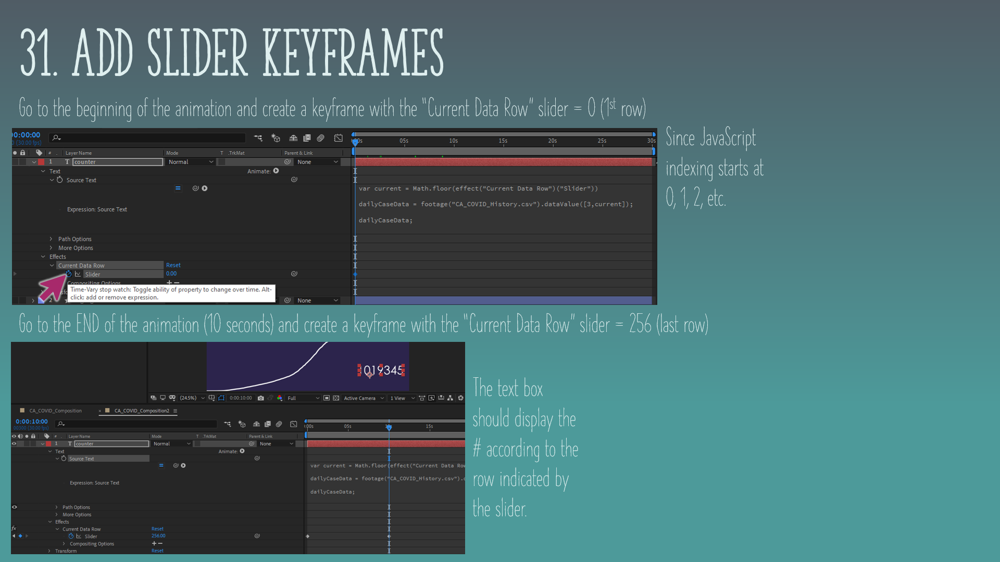

1. **Duplicate counter layer**
1. **Rename & move layers**

    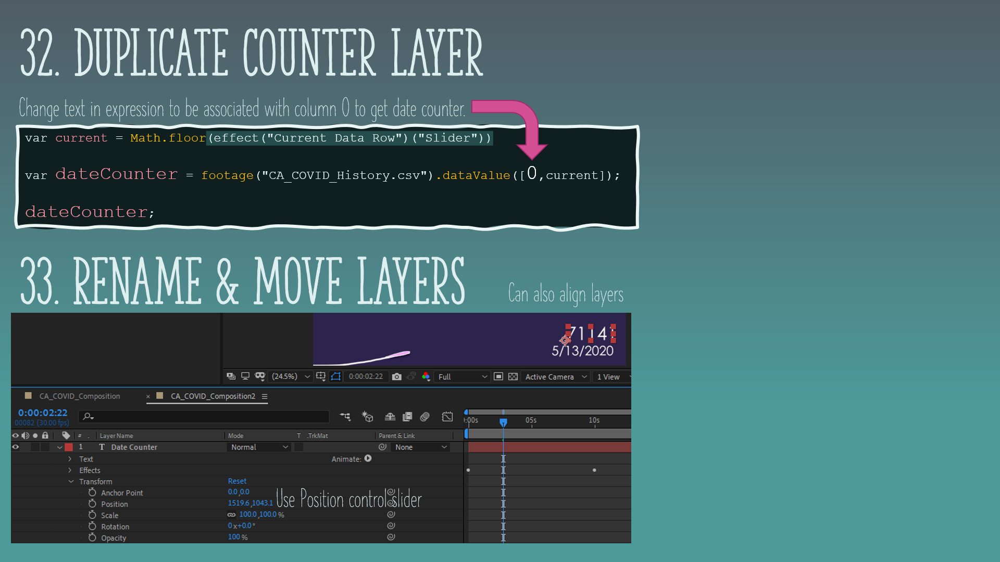

1. **Finishing touches**

    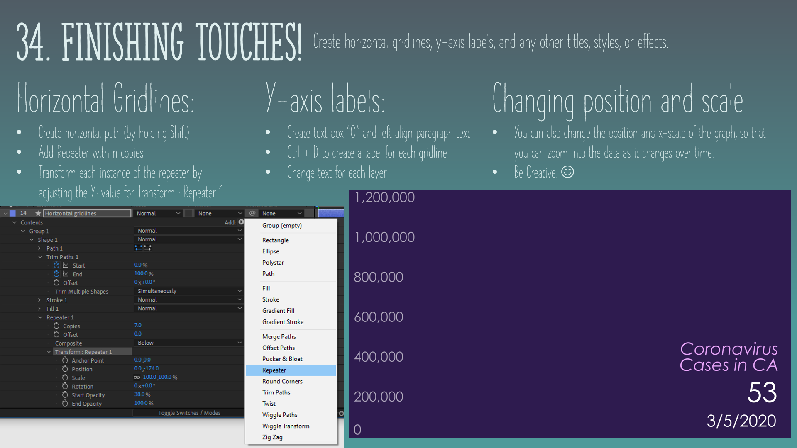
