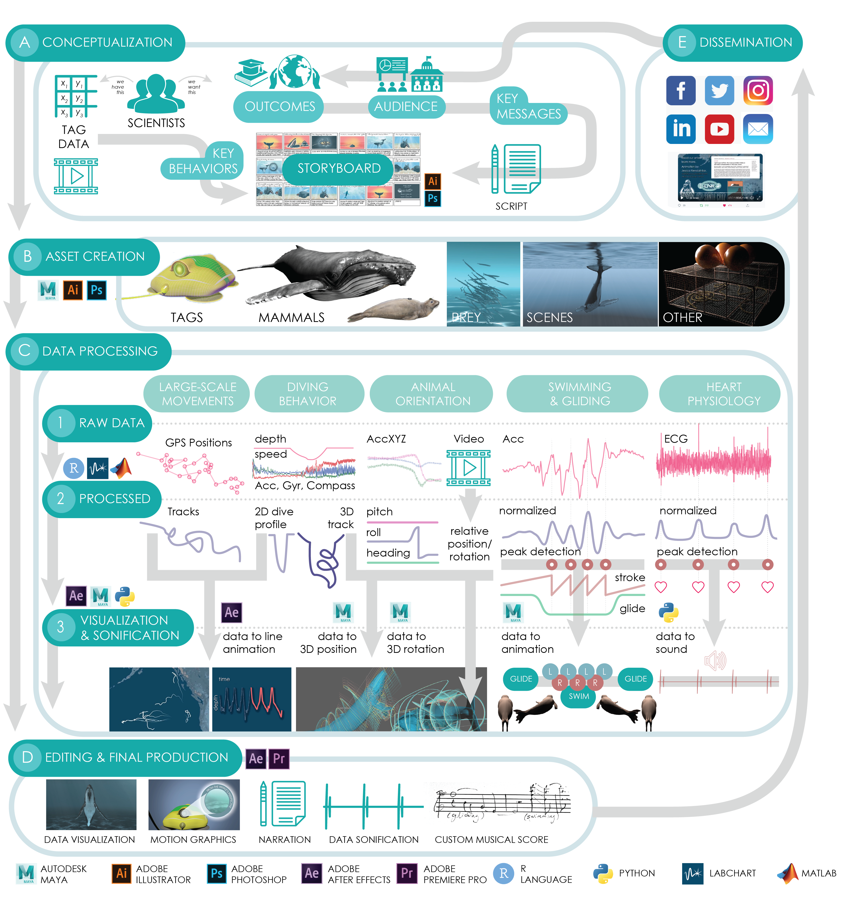

# Visualizing life in the deep
### A creative pipeline for data-driven animations that facilitate marine mammal research, outreach, and conservation

This repository hosts working code we are using to visualize the underwater behavior of marine mammals through animation and interactive graphics. This involves a number of different projects, listed below in more detail. This repository also hosts three in-depth tutorials, where you can learn to create realistic underwater animations that link accelerometer and heart rate data to motion and sound. 

We have additional tutorials and resources on our webpage: [Art for Science Communication Resources](https://jessiekb.com/resources)
Here is a link to our [**Visualizing Life in the Deep**](https://ieeexplore.ieee.org/document/9622956) IEEE VIS Paper that explains our data visualization pipeline:

We established an interdisciplinary team with experts in illustration, animation, data visualization, visual effects, computer science, science communication, and marine mammal biology. We united experts in different animal systems to develop the 4 animations described below. These animations were designed to accompany the publication of scientific articles, some of which are in preparation and others published. Each animation was created following a four-stage approach: conceptualization (storyboarding and scriptwriting), asset creation (creating custom models and illustrations), animation of behavior and physiology (pairing data to 3D and 2D assets), and final production (annotations, narration, and music).

## Animation 1: Humpback alliance. 
Our 3D humpback whale animation visualizes the position and orientation of a group of whales foraging on the ocean floor to determine whether there is coordination or competition between individuals of the group (Wiley et al. in prep). Our animation emphasizes the importance of minimizing the use of bottom-set fishing gear that could disturb and entangle bottom-feeding humpbacks.

## Animation 2: Lightscapes of Fear. 
Our 2D elephant seal animation demonstrates state-dependent risk aversion by showing the shifting decision-making by a seal as it travels across the North Pacific (Beltran et al., 2021). The animation visualizes the geographic location, body condition, and rest timing of elephant seals on their 7-month-long foraging trip. This animation shows that as an animal shifts from inferior to superior body condition (negative buoyancy to positive buoyancy), the seals begin to prioritize resting during the safer, darker, and earlier hours of the day. 

## Animation 3: Sounds of Fear. 
Our 3D elephant seal animation visualizes the position, orientation, swimming behavior, and heart rate of a seal as it dives under two conditions: with and without disturbance caused by the vocalization of a killer whale predator produced from an animal-borne acoustic tag (McDonald et al. in prep). We pair the animal’s heart rate and stroke rate data to sound. This animation demonstrates the fear response of an elephant seal in the wild and helps us understand how these animals respond to stress in their natural environment.

## Animation 4: Paradox of Fear. 
Our 3D narwhal animation visualizes the position, orientation, swimming behavior, and heart rate of a narwhal after release from net entanglement during annual indigenous hunts in East Greenland and during exposure to anthropogenic noise. We pair heart rate and stroke rate data to sound. The animation demonstrates the paradoxical fear response of a narwhal, where a very low heart rate co-occurs with rapid stroking (Williams et al., 2017). This animation demonstrates the impact of an acute disturbance on a wild narwhal and elucidates potential paradoxical physiological responses which could contribute to marine mammal strandings.

## Scripts

Instructions for the following 3D animation steps can be found in: [**00_3D_00_StrokeData_to_Swim.md**](https://github.com/jmkendallbar/VisualizingLifeintheDeep/blob/main/scripts/00_3D_00_StrokeData_to_Swim.md)

1. [**00_3D_00_swim_and_glide.py**](https://github.com/jmkendallbar/VisualizingLifeintheDeep/blob/main/scripts/00_3D_00_swim_and_glide.py): Script to link animated swim cycle to a swim and glide controller
Python script to run in Autodesk Maya's Script editor to add an expression a `SWIM_CONTROL` object that creates two separate attributes: 

Attribute     | Function                                                     | Input
------------- | ------------------------------------------------------------ | ------------
`Swim`        | Links each stroke detection to the beginning of a swim cycle | 0 between strokes or when gliding; 1 at the beginning of a detected stroke (binary only)
`Glide`       | Uses glide strength to pull tail into central position       | 0 when swimming; 1 when gliding (accepts decimal values in between)

2. [**00_3D_01_PositionRotation_Swim.py**](https://github.com/jmkendallbar/VisualizingLifeintheDeep/blob/main/scripts/00_3D_01_PositionRotation_Swim.py): Script to link position, rotation, and swim data to animation
Python script to run in Autodesk Maya's Script editor to drive the position, rotation, and swimming behavior of a swim-controlled scene (output from above OR using [**swim-controlled elephant seal template scene**](https://github.com/jmkendallbar/VisualizingLifeintheDeep/blob/main/scenes/V3_elephantseal_swimcontrolled_template_V1.ma).

Instructions for the following 3D animation steps can be found in: [**01_3D_setKeysFromData_positionRotation.md**](https://github.com/jmkendallbar/VisualizingLifeintheDeep/blob/main/scripts/01_3D_setKeysFromData_positionRotation.md)

3. [**01_3D_setKeysFromData_positionRotation.py**](https://github.com/jmkendallbar/VisualizingLifeintheDeep/blob/main/scripts/01_3D_setKeysFromData_positionRotation.py): Simpler version of script 2 above that only includes Position & Rotation Data

4. [**02_3D_setKeysFromData_swimCycle.py**](https://github.com/jmkendallbar/VisualizingLifeintheDeep/blob/main/scripts/02_3D_setKeysFromData_swimCycle.py): Simpler version of script 2 above that includes pitch, roll, depth, and swimming behavior, but NOT heading data (use if you do have accelerometer but not magnetometer data)

Instructions for the following 2D animation steps can be found in: [**03_2D_lineAnimation_from_CSV.md**](https://github.com/jmkendallbar/VisualizingLifeintheDeep/blob/main/scripts/03_2D_lineAnimation_from_CSV.md)

5. [**03_2D_lineAnimation_from_CSV.js**](https://github.com/jmkendallbar/VisualizingLifeintheDeep/blob/main/scripts/03_2D_lineAnimation_from_CSV.js): Script to create data-driven line animations in After Effects

Run the following Python script in a Python editor of your choice (I use Spyder within Anaconda to manage packages) - you will need to record the sound output from your computer using another software like ActivePresenter.

6. [**04_AUD_sound_from_HR.py**](https://github.com/jmkendallbar/VisualizingLifeintheDeep/blob/main/scripts/04_AUD_sound_from_HR.py)

## Sample Scenes

1. [**00_3D_elephantseal_swimcontrolled_template_V1.ma**](https://github.com/jmkendallbar/VisualizingLifeintheDeep/blob/main/scenes/00_3D_elephantseal_swimcontrolled_template_V1.ma)
Sample Autodesk Maya Scene with 3D elephant seal model for quick start before running Script 2 above.

2. [**02_3D_Linking_Strokes_to_Swim.ma**](https://github.com/jmkendallbar/VisualizingLifeintheDeep/blob/main/scenes/02_3D_Linking_Strokes_to_Swim.ma)
Sample Autodesk Maya Scene with 3D elephant seal model for quick start before running Script 2 above.

3. [**03_2D_Linking_Data_to_LineAnimation.aep**](https://github.com/jmkendallbar/VisualizingLifeintheDeep/blob/main/scenes/03_2D_Linking_Data_to_LineAnimation.aep)
Sample After Effects Project that links CSV data to Line Animation.

## Sample Data

1. [**01_Example_PositionRotationData.csv**](https://github.com/jmkendallbar/VisualizingLifeintheDeep/tree/main/data)
Example simple (and fabricated) dataset to show the type of data you can use to control position and rotation in Maya.

2. [**01_Example_PositionRotationData_headers.csv**](https://github.com/jmkendallbar/VisualizingLifeintheDeep/blob/main/data/01_Example_PositionRotationData_headers.csv)
Headers for example simple (and fabricated) dataset to show the type of data you can use to control position and rotation in Maya.

3. [**02_Example_StrokeRateData.csv**](https://github.com/jmkendallbar/VisualizingLifeintheDeep/blob/main/data/02_Example_StrokeRateData.csv)
Example simple dataset to show the type of data you can use to control swimming and gliding in Maya.

4. [**03_Example_LineAnimation_COVIDdata.csv**](https://github.com/jmkendallbar/VisualizingLifeintheDeep/blob/main/data/03_Example_LineAnimation_COVIDdata.csv)
Example sample dataset to show the type of data you can use in 2D line animations in After Effects.

5. [**04_Example_Narwhal_HRdata.csv**](https://github.com/jmkendallbar/VisualizingLifeintheDeep/blob/main/data/04_Example_Narwhal_HRdata.csv)
Example sample dataset to show the type of data you can link to sound using python.

6. [**04_heart_badum.wav**](https://github.com/jmkendallbar/VisualizingLifeintheDeep/blob/main/data/04_heart_badum.wav)
Example sound file to link to data using Script 6 above.