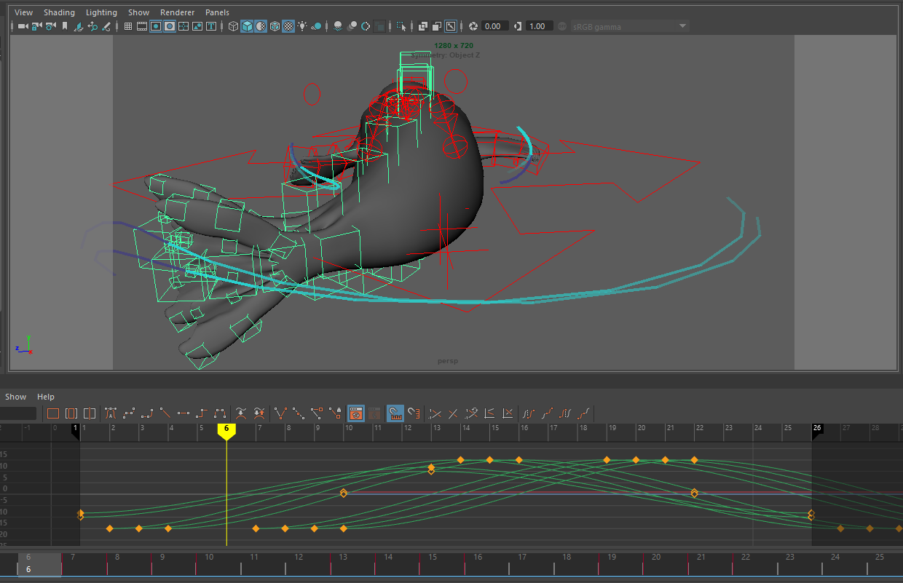

# Linking data to an animation of locomotion
These steps can be applied to animating any repetitive locomotion such as swimming, walking, flying, etc. Here we demonstrate the concept with a swim cycle for an elephant seal, whose primary motion is along the y axis, with tail motion from left to right.

## Data Processing
We first need to process the data to get it into the format where we can identify individual strokes to pair with animation and then export that data to be used in the animation.

1. Visualize accelerometer data and identify primary axis of motion for a swim cycle. 

    Ex. If the accelerometer has been calibrated correctly, the axes should line up with the axes of the animal. Therefore, the primary axis of motion for a seal or fish should be in the horizontal plane (identified in y-axis accelerometry) and a whale or dolphin should be in the vertical plane (identified in x-axis accelerometry). 
1. Normalize, filter, and smooth this channel as necessary to facilitate accurate peak detection.

    Peak detection algorithms exist for many programs and often apply similar methods. We found that the most helpful steps to improve signal detection were ***FINISH SECTION

## Animate a swim cycle using an animation layer:

 1. Create new animation layer and add all swim cycle controls to that layer.

    For elephant seal model, select all rig controls from the tip of the tail to the core of the body. If you only select the top joint in the hierarchy, it will not add all controls to the animation layer. Create a new animation layer in the Channel Box/Layer Editor > Anim > Layers > Create Layer from Selected.

1. Set swim cycle keyframes: 

    1. **Add start and end keyframes.** Start keyframes for beginning and end of swim cycle by adding keyframes rotateXYZ = MIN for all rig controls at frame 1 and frame 26.

        Ex. For elephant seal model, set tail position to far left by adjusting rotateY of tail joints to -15 at frame 1 and 26.
    2. **Add central keyframes.** Add a keyframe for the opposite position at frame 13.

        Ex. For elephant seal model, set tail position to far right by adjusting rotateY of tail joints to +15 at frame 13.
        
    3. **Offset keys** for a more organic look, so that distal joints move with a delay compared to more proximal joints.

        Ex. For elephant seal model, work from the top of the joint hierarchy from proximal (around the axillary region) to distal locations (tip of nose, tip of fore flippers, tip of tail). For each subsequent joint, offset all three keys (-15 +15 -15) one keyframe later than the more proximal joint. 
        
    4. **Optional: add additional keyframes** and rotation dimensions to improve accuracy and complexity of locomotion cycle. 
        Ex. For elephant seal model, we created a figure-8 motion path for the fore-flippers which included rotation in three dimensions. 
        
1. 
## B. Visualizing behavioral and physiological responses of northern elephant seals to predator vocalizations of killer whales https://twitter.com/jmkendallbar/status/1365481886819045376
      
1. Linking instantaneous heart rate data to sound using psychopy (Auditory Neurophysiology python toolbox):
      HR_sound.py