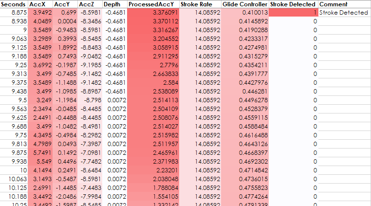
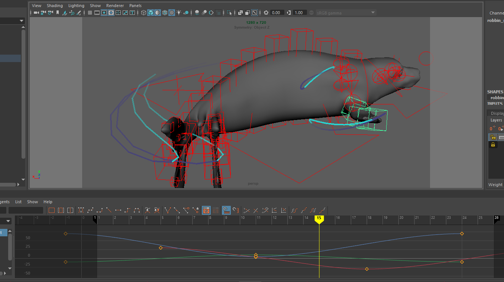

# Linking accelerometer data to swim cycle
These steps can be applied to animating any repetitive locomotion such as swimming, walking, flying, etc. Here we demonstrate the concept with a swim cycle for an elephant seal, whose primary motion is along the y axis, with tail motion from left to right. 

## Data Processing
We first need to process the data to get it into the format where we can identify individual strokes to pair with animation and then export that data to be used in the animation. For this example, we converted the data to European Data Format in EDFBrowser and then visualized and processed data in LabChart. However, these steps can be easily adapted to analysis in R, Matlab, or Python. 

1. **Visualize accelerometer data** and identify primary axis of motion for a swim cycle. 

    Ex. If the accelerometer has been calibrated correctly, the axes should line up with the axes of the animal. Therefore, the primary axis of motion for a seal or fish should be in the horizontal plane (identified in y-axis accelerometry) and a whale or dolphin should be in the vertical plane (identified in x-axis accelerometry). 
1. **Normalize, filter, and smooth this channel** as necessary to facilitate accurate peak detection.

    Peak detection algorithms exist for many programs and often apply similar methods. We found that the most helpful steps to improve signal detection included smoothing and applying median and high pass filters. 

1. **Apply your peak detection algorithm** to generate event markers or comments for each identified stroke. Use these event markers to generate a binary timeseries where 1 indicates that the beginning of a stroke has been detected and 0 indicates no stroke was detected.

1. Once you have peak detection you are happy with, **calculate the instantaneous stroke rate** over time to pair with your event detection array.

1. Generate a timeseries to be used as your **glide controller** where a value of 1 indicates the animal is gliding and 0 indicates the animal is swimming.

## Example Data: `V6_Example_StrokeRateData.csv`

Example data from a diving elephant seal sampled at 16Hz where channels are as follows:
* **AccX, AccY, AccZ** = calibrated but raw accelerometer data (unfiltered)
* **Depth** = depth in meters
* **Processed AccY** = result of filtering and smoothing (Arithmetic function applied in LabChart: `SmoothSec(Highpass(MedianFilter(Ch2,10),0.3),0.5)`). For juvenile elephant seals, we used a 500-millisecond smoothing function with a median filter of 3 samples, and high pass filtering at 0.3Hz, excluding stroke cycles faster than 900ms (61bpm).
* **Stroke Rate** = cyclic measurement based on previous channel, excluding stroke cycles faster than 900ms (61bpm).
* **Glide Controller** = We applied an Arithmetic function in LabChart to turn values within (0bpm,15bpm) to 0: `SmoothSec(Window(Ch6,0,15),15)`
For our elephant seal animation, we set swim speeds between 0 and 15 strokes per minute to 1 (gliding) and then applied a triangular smoothing window of 15 seconds.
* **Stroke Detected** = Wherever a stroke event is detected, make this 1, otherwise keep it as 0. Can use Excel formula `=IF(J144="",0,1)`.

## Animate a swim cycle using an animation layer:
We make use of an educational license of Autodesk Maya for this animation, but it is possible to adapt this pipeline to Blender or another animation software.

 1. Create new animation layer and add all swim cycle controls to that layer.

    For elephant seal model, select all rig controls from the tip of the tail to the core of the body. If you only select the top joint in the hierarchy, it will not add all controls to the animation layer. Create a new animation layer in the `Channel Box/Layer Editor > Anim > Layers > Create Layer from Selected`.

1. **Add start and end keyframes.** Start keyframes for beginning and end of swim cycle by adding keyframes rotateXYZ = MIN for all rig controls at frame 1 and frame 26.

    Ex. For elephant seal model, set tail position to far left by adjusting rotateY of tail joints to -15 at frame 1 and 26.
2. **Add central keyframes.** Add a keyframe for the opposite position at frame 13.

    Ex. For elephant seal model, set tail position to far right by adjusting rotateY of tail joints to +15 at frame 13.
    
3. **Offset keys** for a more organic look, so that distal joints move with a delay compared to more proximal joints.

    Ex. For elephant seal model, work from the top of the joint hierarchy from proximal (around the axillary region) to distal locations (tip of nose, tip of fore flippers, tip of tail). For each subsequent joint, offset all three keys (-15 +15 -15) one keyframe later than the more proximal joint. 
    
4. **Optional: add additional keyframes** and rotation dimensions to improve accuracy and complexity of locomotion cycle. 
    Ex. For elephant seal model, we created a figure-8 motion path for the fore-flippers which included rotation in three dimensions. 
    
1. **Loop Animation**: Select all keyframes and cycle your animation to pre-infinity and post-infinity so that the animation curves interpolate correctly.

## Import Swim Controller
If you have animated a custom swim cycle with a new 3D model, you will need to import our swim controller into your new scene (or create your own with the same name and extra attributes). To do this:

1. Open our sample scene `Example_SwimController_ElephantSeal.ma`.
1. Select `SWIM_CONTROL` object. 
1. File > Export Selection
1. Open your custom scene.
1. File > Import and find your saved `SWIM_CONTROL` exported object.

## Connect Swim Controller to Swim Cycle
Here, we connect the `SWIM_CONTROL` object to the keyframes in the 26-frame swim cycle, so that simple inputs for two attributes, `swim` and `glide` of the `SWIM_CONTROL` can control a complex animation cycle.

1. Open clean Maya scene with a 26-frame animated cycle, with all controls added to a single layer. Save a copy of this scene before linking the swim controller. 
1. Open script editor and `01_swim_and_glide.py` Python script. 
1. Before running the script, verify that the layer which contains your animation controls is being referenced properly (change from the default `'Swim_Cycle'`).
1. Run the script! :)
1. Save a new version of your swim controlled scene.

## Connect Swim Controller to Data!
Next, we will allow the data to drive the animation. 

1. Open a copy of the swim controlled scene.
2. Open the script editor and `02_setKeysFromData_swimCycle.py` Python script.
1. Before running the script, **update the script with column names and indices** from your own data. Note that Python indexing starts at 0 for the first column.
1. Assure that the script uses the **proper sampling frequency (fs = __Hz), start time, and end time (in seconds).**
1. **Run script** to add keyframes from the data.
The set keyframes for the `swim` and `glide` attributes of `SWIM_CONTROL` should look like this:

And your video should look something like this:

## Final Production

From here, you can place your animal into a scene and/or add additional keyframes to set its position and rotation. See tutorials `Create_Underwater_Environment.md` and `Linking_Position_Rotation.md` for more information.